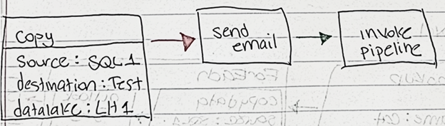
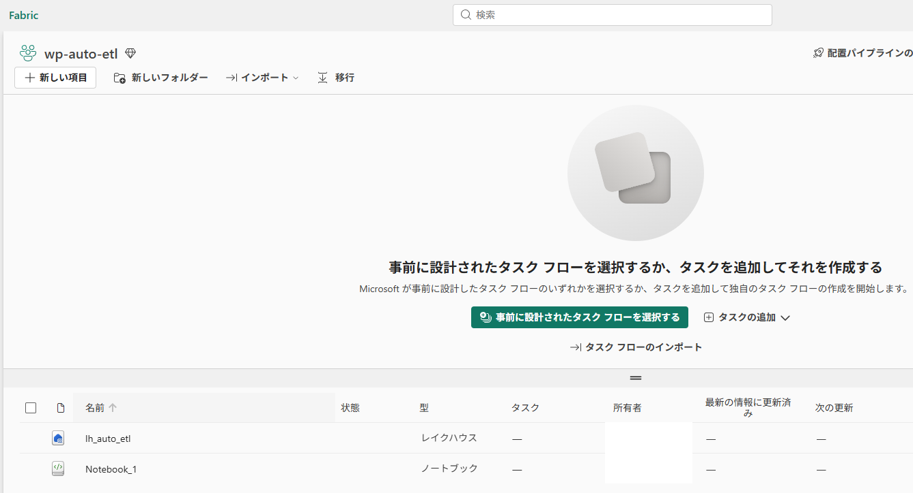
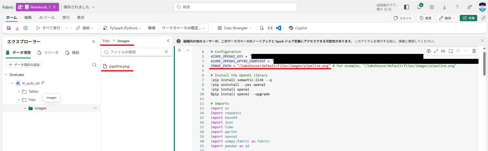
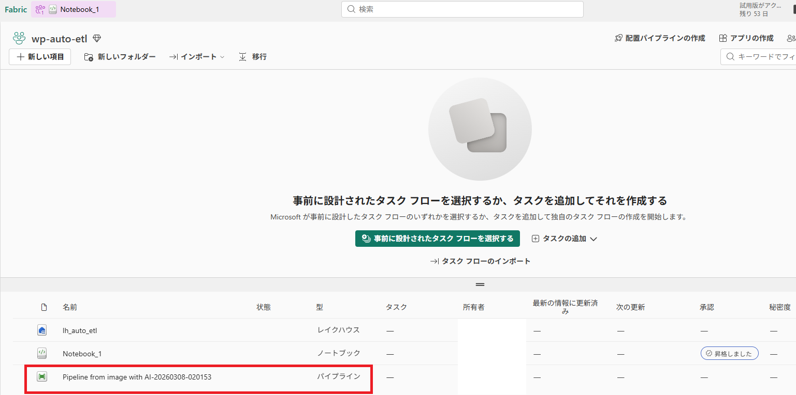
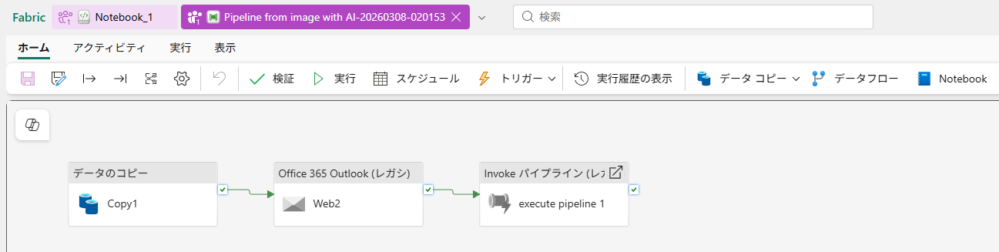
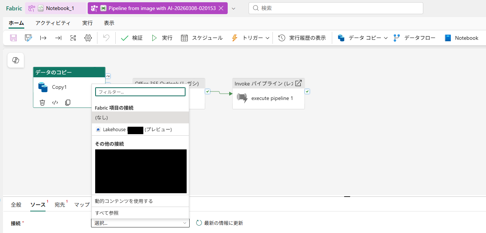

# スケッチ画像からデータパイプライン（ETL）を生成する

## はじめに
生成AIやAIエージェントの登場によってDXが加速し、さまざまな企業で生産性向上、業務効率向上を目指した業務改善に取り組まれています。
しかしながら、AI活用を進めたい企業がぶつかる壁が、データの準備（データパイプラインの構築）です。
Snowflake社の[調査](https://cxotoday.com/media-coverage/four-out-of-five-businesses-are-unable-to-capitalise-on-ai-due-to-poor-data-foundations-reports-mit-technology-review-insights-in-partnership-with-snowflake/)では、5社中4社がデータ基盤の弱さからAIを活用出来ていないと報告されています。

企業がAI活用するために、データの準備に立ちはだかるのが データ前処理（ETL） の壁です。  
データ分析の現場では 「分析の8割は前処理に費やされる」 と言われています。

なぜこれほど前処理が重いのか。
そして、スケッチからパイプラインを自動生成できる技術は、この課題をどう解決するのか。

DX担当者、データサイエンティストが押さえておくべきポイントを整理します。

## なぜ“データ分析は前処理が8割”と言われるのか
1. データが揃っていない
部門ごとにフォーマットが違い
- Excel
- CSV
- 業務システム
- MAツール
- ECプラットフォーム
など、バラバラに存在します。
これらを 統合して使える形にするだけで膨大な時間がかかります。

2. データが汚れている
現場のデータは想像以上に揺れています。
- 住所の表記揺れ
- 商品名のゆらぎ
- 欠損値
- 異常値
- 型の不一致
分析以前に、“正しいデータ” を作る作業が必要です。

3. ビジネスルールが複雑
「売上」の定義ひとつ取っても、部門やシステムによって意味が違うことがよくあります。

そのため、
KPI定義の統一 → データ変換 → 検証  
という工程が必須になります。

4. 前処理は属人化しやすい
Excel職人や特定のエンジニアに依存し、「この人がいないと数字が出ない」状態が発生します。
これが、前処理に時間がかかる最大の原因のひとつです。

## Microosoft Fabric × Azure OpenAI で実現
データパイプラインの自動化を“現実のもの”にするのが、Microsoft Fabric と Azure OpenAI の組み合わせです。  
Fabric が持つ統合データ基盤と、Azure OpenAI の画像入力が連携することで、これまで専門知識が必要だった 
ETL 設計や変換ロジックの作成を、スケッチ画像の指示だけで実行できるようになります。  
人が考えたデータの流れを AI がそのまま解釈し、パイプライン(ETL)として作成します。

今回は、チュートリアルにある、このスケッチをパイプラインとして生成します。

1. [Azure Portal](www.portal.azure.com)上でAzure OpenAIサービスを作成しておきます。
2. [Foundry Portal](https://ai.azure.com/)の左ブレードからデプロイを選んで「gpt-4o」モデルをデプロイしておきます。
3. デプロイしたモデルを選択して「エンドポイント」と「API Key」をメモしておきます。
4. [サンプルコード](https://github.com/n0elleli/Azure-DataFactory/blob/fabric_samples/FabricSamples/Image%20to%20Pipeline%20with%20AI/NotebookSample.py)をダウンロードして、[3](#step3)でメモした値に置き換えます。
5. [Fabric Portal](https://app.fabric.microsoft.com/)にログインしてワークスペースを作成します。
6. ワークスペース内にLakehouseを作成します。
7. Lakehouseにスケッチをアップロードします。
8. ノートブックを作成し、[4](#step4)のコードを貼り付けます。
9. ノートブックを実行します。

### 実行前と実行後の比較
事前のワークスペースの状態

ノートブックを実行します。

ノートブックを実行後のワークスペースを確認するとパイプラインが追加されたことを確認
このパイプラインをクリック

作成されたパイプライン

作成されたパイプライン内のコピージョブなど、各種ジョブに必要な設定を実施

> ⚠️ **注意**  
> サンプルコードではAPI Keyを直接指定していますが、本番運用ではマネージドIDを利用してパスワードレスなコードにするなどコードを改善する必要があります。

## DX担当者にとってのメリット
1. 専門知識がなくてもデータ活用プロジェクトを前に進められる  

従来は、データパイプラインの構築をエンジニアに依頼し、
要件定義 → 設計 → 実装 → テスト と長い工程が必要でした。

スケッチ生成なら、DX担当者が自分で “やりたい流れ” を描くだけで、
初期プロトタイプが即座に完成します。

これにより、
- 「まず動くものを作る」
- 「すぐに改善する」

というアジャイルな進め方が可能になります。

2. コミュニケーションコストが劇的に下がる  

DX担当者とデータサイエンティスト、データエンジニアの間で最も時間がかかるのが、
「どんな処理をしたいのか」を正確に伝えることです。
スケッチは、言葉よりも誤解が少なく、
AIがそのままパイプラインに変換してくれるため、
要件のすり合わせにかかる時間が大幅に短縮されます。

3. PoC（検証）が高速化し、意思決定が早くなる  

データ活用の初期段階では、  
「このデータを組み合わせたら価値が出るのか？」  
「この指標は作れるのか？」  

といった検証が欠かせません。  
スケッチ生成なら、
思いついたアイデアをその日のうちに形にできるため、
PoCのスピードが圧倒的に上がります。

結果として、
- 施策の判断が早くなる
- 無駄なプロジェクトが減る
- 成果が出るまでの期間が短くなる

という効果が生まれます。

4. 属人化を防ぎ、誰でも理解できるデータ基盤になる  

スケッチは誰が見ても理解しやすく、
AIが生成したパイプラインもその構造を可視化できます。
これにより、「あの人しか分からないデータ処理」  という属人化を防ぎ、組織としてデータ活用を継続しやすくなります。

5. データ活用の民主化が進む  

スケッチ生成は、データエンジニアだけでなく、
- マーケティング
- 営業企画
- 経営企画
- 店舗運営  

など、現場の担当者でも扱える可能性があります。
現場が自分でデータパイプラインを作れるようになれば、
データ活用が一部の専門家だけのものではなくなるのです。

### Appendix
マイクロソフトはOsmosという会社を[買収](https://blogs.microsoft.com/blog/2026/01/05/microsoft-announces-acquisition-of-osmos-to-accelerate-autonomous-data-engineering-in-fabric/)しており、データパイプラインの作成は、今後、ますます便利になるかもしれません。

### 参考
- https://learn.microsoft.com/ja-jp/fabric/data-factory/image-to-pipeline-with-ai

- https://blog.fabric.microsoft.com/ja-JP/blog/use-azure-openai-to-turn-whiteboard-sketches-into-data-pipelines/
